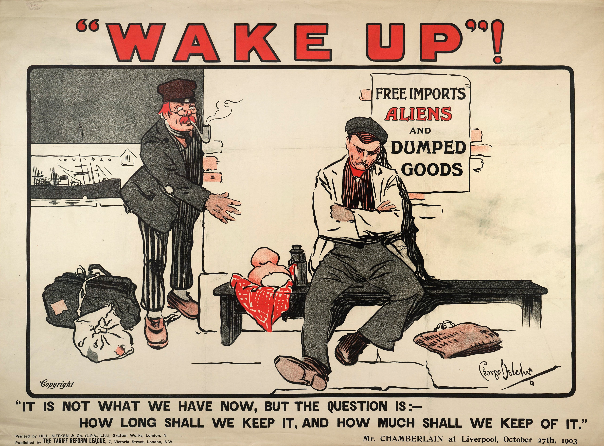

```{r setup, include=FALSE}
knitr::opts_chunk$set(echo = FALSE)
```

```{r, preview=FALSE}
 # image du gars qui dors :p
```


```{r mtcars, layout="l-body-outset", eval=TRUE, echo=FALSE}
#library(kableExtra)

#head(mtcars) %>%
#        kbl(caption = "mtcars is always there for us.") %>%
 #       kable_paper("hover", full_width = F)
```

# Analyse de donnes de jeux vidéos Steam. 
Les données dont on va analyser aujourd'hui concerne les donnés des jeux vidéos steams disponible sur le site de  [tidytuesday](https://github.com/rfordatascience/tidytuesday/blob/master/data/2021/2021-03-16/readme.md#gamescsv). 
Comme noté sur le site de tidytuesday, les données qu'on va analyser aujourd'hui n'ont pas besoin de nettoyage préalable. 
Nous pouvons ainsi voir les différents variables ainsi que leurs contenu dans le tableau suivant ( qui est également disponible sur le site de tidytuesday)

```{r tabgame, eval=TRUE, echo=FALSE}
library(kableExtra)
df <- read.csv(file = "tabgame.csv")
df %>%
      kbl(caption = "Description de du jeu de donnée") %>%
      kable_paper("hover", full_width = F)
```


```{r}
#tuesdata <- tidytuesdayR::tt_load('2021-03-16')
#tuesdata <- tidytuesdayR::tt_load(2021, week = 12)

#games <- tuesdata$games
```


