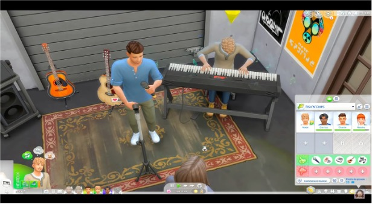

# Introduction

Partager une passion peut se faire de plusieurs manières. Dans le
contexte des jeux vidéo, la passion se partage par l'intermédiaire de
discussions, de guides ou encore de parties de jeu sur internet. C'est
le cas des machinimas et des let's play qui permettent non seulement de
partager la passion du jeu, mais permet aussi aux machinamakers [^1] de
partager leurs idées avec le reste du monde (Bonenfant &
Trépanier-Jobin, 2018). Le terme machinima est issu de la contraction
des termes machine et cinéma introduit par Hugh Hancock. Le let's play
est considéré comme un machinima non narratif par Glas (2015). Ce
dernier est définit comme un enregistrement ou diffusion vidéo qui
contient des images de jeu avec des commentaires du joueuse.eur.s. La
plupart des études menées sur les pratiques de partages de vidéos de jeu
en ligne se concentrent uniquement soit sur le machinima soit sur le
let's play. Pourtant, étudier la combinaison des machinimas et des let's
play permet une compréhension approfondie de l'expression de soi en
ligne. Partant du constat que le machinima et le let's play sont une
continuité des jeux vidéo et que le monde vidéoludique est aujourd'hui
toujours hostile à la présence des femmes (Paaßen et al., 2017 ; Stone,
2019 ; Williams et al., 2009), nous analyserons, dans cet article
comment les femmes s'approprient le jeu The Sims 4 et comment elles
s'expriment par l'intermédiaire de machinima et de let's play sur la
plateforme YouTube. Après avoir fait un aperçu des études mené sur le
sujet, nous allons discuter de l'auto- identification des femmes en tant
que joueuses avant de parler des stratégies relationnelles sur la
plateforme YouTube. Ensuite, nous allons discuter de l'appropriation du
jeu The Sims 4 pour performer des histoires qui vont à l'encontre des
stéréotypes de genre.

[^1]: Créatrice ou créatrice.eur de machinima

# État de l'art

Jouer à un jeu vidéo est un phénomène culturel qui est devenu très
populaire ces dernières années. On entend par « jouer » une activité
vidéoludique qui consiste à s'approprier un jeu vidéo. En effet, il y a
différentes façons d'aborder un nouveau jeu, mais que ce soit explorer
un vaste monde ou créer soit même un monde, il y a, à degrés différents,
une forme d'appropriation du jeu. On entend par appropriation la liberté
qu'à le jouer d'interpréter et de mener des actions dans le jeu
(Bonenfant, 2008). Comme l'a relevé Genvo (2008), « le jeu pour exister
doit permettre l'expression de la créativité de l'individu ». Genvo
illustre ses propos avec l'exemple d'un enfant qui modifie les règles de
jeu établies tout en adaptant l'activité à leur représentation mentale
de ce qui est ludique. Dans les jeux vidéo, les règles sont moins
facilement modifiables du fait de leur support informatique. De ce fait,
les différentes formes d'activités ludiques dans un jeu vidéo ne
signifient pas toujours qu'il y a appropriation du jeu, cela s'inscrit
au contraire dans une culture de l'industrie du jeu vidéo. Plus
précisément, il ne peut y avoir de négociation de règles du jeu
uniquement si le constructeur du jeu l'autorise. Ainsi, il y a une
appropriation du jeu à différent degré, cependant, ces actions ne sont
possibles que parce que cela est toléré par le jeu. Dans la continuité
de l'appropriation du jeu, il existe la création de films par
l'intermédiaire des performances du jeu, le film ainsi créé s'appelle
« machima ». Contrairement aux règles définies dans un jeu, le machinima
est une activité qui détourne le jeu (Barnabé 2015). Un détournement est
un œuvre artistique qui réécrit le jeu. Le machinima peut avoir
plusieurs objectifs notamment, archiver un jeu ou une communauté de jeu
(Lowood 2011), servir de matériel pédagogique (Muldoon et al., 2008) ou
encore raconter une histoire propre au machinimamaker (Barnabé, 2015).
Plusieurs études ont été menées sur les machinimas, c'est notamment le
cas de Nitsche (2005) qui définit le machinima comme l'utilisation de
moteurs de jeu 3D pour générer une performance enregistrée dans des
mondes virtuels. Le détournement du jeu par l'intermédiaire du jeu peut
donc prendre plusieurs formes. C'est-à-dire que le machinimamaker peut
utiliser différentes parties du jeu pour produire son film. Ces parties
concernent notamment, le(s) cinématique(s), l'environnement du jeu, les
avatars du jeu, mais aussi la manière dont le jeu est joué. Cependant,
dans la globalité, il existe deux styles de machinima, selon l'usage
dont est fait le jeu : le style objectif qui utilise le jeu dans son
ensemble et le style subjectif qui utilise le jeu comme simple outil
(Barnabé 2015).

Il existe une forme de machinima que l'on appelle non narrative (Glas
2015). Cette forme de machinima est également connue sous le nom de
« let's play ». Un let's play est un enregistrement ou diffusion vidéo
qui contient des images d'un jeu avec des commentaires du joueuse.eur.s.
Les commentaires peuvent être diffusés en version audio, ou en version
vidéo où joueuse.eur.s s'affichent dans un coin de l'écran. Durant les
let's play les vidéastes peuvent commenter le jeu de sorte à le
critiquer, le promouvoir, l'examiner ou à en faire une parodie (Burwell
& Miller, 2016). Il n'y a pas de règle unique à la manière de faire de
let's play, en effet, il existe différentes manières de montrer des
séquences de gameplay (Kerttula, 2019). Lors d'un let's play les
joueuse.eur.s peuvent mettre en avant leurs compétences, cependant, le
but d'un let's play est souvent de montrer aux autres joueuse.eur.s
comment mener à bien une quête ou encore comment améliorer son jeu. Les
let's play ont ainsi une fonction pédagogique qui invite le
spectatrice.eur à jouer au jeu. La forme non narrative du let's play
viens du fait que le public regarde non seulement l'œuvre, mais
également l'artiste commenter son œuvre. En effet, dans un machinima, le
public regarde avant tout une œuvre artistique tandis que dans un let's
play, le public regarde non seulement le jeu (l'œuvre), mais aussi la
créatrice.eur commenter son œuvre. En effet, le let's play présentent
avant tout un gameplay et non un récit (Glas 2015). Les machinimas et
les let's play sont partagé par les artistes sur des plateformes de
diffusion tels que Twitch, YouTube et Facebook Gaming. Ces plateformes
ont été l'objet de plusieurs études. C'est encore plus le cas de Twitch
lorsqu'on parle de diffusion de jeux vidéo. Ces études concernent
plusieurs aspects de la plateforme, mais dans le cas présent, nous nous
intéressons plus spécifiquement à la place des femmes. Les études qui
ont été menées sur ce sujet se sont intéressées à l'analyse des
commentaires (Nakandala et al., 2016), la présentation des femmes
(Uszkoreit, 2018), la concurrence, le sexisme et le harcèlement dont
elles sont victimes (Anderson, 2017 ; Ruberg, 2021 ; Ruberg et al.,
2019) et les stratégies qu'elles mettent en place pour pallier ces
obstacles (Sjöblom et al., 2019). Comme dit précédemment, ces études ont
été menées sur la plateforme Twitch. De plus, lors de nos recherches sur
les let's play nous avons remarqué que le sujet a été peu abordé sous un
angle social. Les études universitaires publiées sur le let's play sont
souvent des recherches relatives à l'aspect juridique (Coogan, 2018 ;
Hagen, 2018 ; Postel, 2017 ; Vogele, 2017), informatique (Guzdial et
al., 2018 ; Nylund, 2015 ; Roitberg et al., 2021 ; Wong et al., 2017 ;
Zhu, 2021), pédagogique (Mason, 2021) ou encore linguistique (Schmidt &
Marx, 2021). Nous nous sommes donc intéressés aux let's play, plus
précisément, aux créations artistiques contenant des let's play et
machinima en même temps sur la plateforme YouTube.

Pour y arriver, nous nous sommes basés sur les analyses effectuées par
Trépanier-Jobin (2017) sur les parodies afin de comprendre comment les
machinimas remettent en question les stéréotypes de genre. Nous nous
sommes également basés sur l'étude de Uszkoreit (2018) qui explore les
avantages et difficultés de la diffusion en ligne de contenus
vidéoludique par des joueuses. Nous avons choisi de nous inspirer de ces
deux articles, car elles traitent non seulement de la question du genre
dans le monde vidéoludique, mais également des contenus des vidéos
publiés et des informations publiées sur la chaine des vidéastes. Nous
allons ainsi dans un premier temps étudier les vidéos (machinima et
let's play) publiés par des youtubeuses et dans un second temps étudier
les autres contenues publiées sur leur chaine.

# Méthodologie de recherche

Dans le cadre de cette enquête, nous avons mené une enquête auprès de
sept vidéastes qui diffusent leurs parties de jeu sur la plateforme
YouTube. Nous avons ainsi mené des observations sur leur chaine YouTube
et avons suivi leurs comptes sur différentes autres plateformes. Ce sont
des plateformes sur lesquelles elles nous invitent à les suivre pour
avoir plus de contenus. Nous avons limité la collecte de données aux
youtubeuses qui remplissaient les critères suivants : 1) être une femme
2) créations de machinima ainsi que diffusion de Let's play, 3) active
au cours de l'année écoulée et dont l'archive vidéo est librement
accessible. Étant donné que nous souhaitons étudier l'appropriation des
jeux par les femmes nous avons choisi uniquement des youtubeuses. Le
deuxième critère nous permet d'analyser la manière de jouer, mais aussi
ce qui est exprimé à travers les histoires contées dans les vidéos. De
plus, dans les vidéos visionnées les let's play et les machinimas sont
utilisé ensemble pour raconter la même histoire. En effet, les deux se
complètent. En dernier lieu, nous avons décidé de ne pas visionner les
contenus des youtubeuses qui ne sont plus actives ainsi que celles qui
limitent leurs vidéos aux abonné.e.s. uniquement. L'industrie du jeu
vidéo est en constante évolution, les créatrice.eur de jeu produisent
continuellement de nouveaux contenus. Par conséquent les créatrice.eurs
de vidéos sortent également de nouveaux contenus fréquemment afin
d'avoir des contenus à jour, c'est la raison pour laquelle nous avons
choisi de visionner uniquement les contenus de youtubeuses actives. Afin
d'obtenir des informations sur les youtubeuses, nous avons regardé les
pages de présentation de chaque chaine YouTube ainsi que ceux des pages
connexes (Twitch, Instagram, Twitter, Facebook). Nous avons choisi les
sept youtubeuses de manière à remplir les conditions mentionnées ci-
dessus. Ainsi, les youtubeuses choisies sont issues de différents pays
(France, Belgique, États-Unis et Canada), dont la moyenne d'âge est de
26 ans. Les youtubeuses qu'on a choisies ont un nombre d'abonnés allant
de 50k à 284k. Nous avons choisi d'analyser 30 heures de vidéos de let's
play plus récente de Youtubeuse qui joue au Sims 4. Pour étudier les
vidéos, nous avons visionné une playlist de machinima et let's play de
chaque chaine. Ensuite, nous nous sommes concentrés sur l'environnement
de travail, le choix de jeu, les plateformes de communication, ainsi que
les thématiques abordées dans les machinima.

## 1. Environnement de travail

L'environnement de travail exerce une grande influence sur le rendu
final du machinima. Nous entendons par environnement de travail les
appareils et logiciels qui permettent la création de machinima et la
diffusion de parties de jeux vidéo. C'est-à-dire, toutes les
caractéristiques relatives aux microphones, ordinateurs ou logiciels
qu'elles utilisent pour créer leurs œuvres. Cet axe d'observation
concerne également le lieu de diffusion des vidéos (le lieu du tournage,
qui peut être à domicile ou dans un studio dédié), le pseudo ainsi que
l'apparence qu'elles ont dans les vidéos. Nous avons choisi d'étudier
cet axe, car sur YouTube la vidéaste joue un rôle. Dans sa performance,
la youtubeuse choisit avec soin tout ce qui est montré à l'écran. En
effet, ces derniers reflètent les centres d'intérêt et les
particularités de la vidéaste et de sa chaine.

## 2. Le choix de jeu

Le jeu choisi a un impact sur le rendu final des machinimas. Les
youtubeuses qu'on a observées ont choisi de créer des machinimas par
l'intermédiaire du jeu « The Sims 4 ». Le jeu The Sims 4 est un jeu de
simulation de vie populaire créé par Will Wright. Il est développé par
Maxis et publié par le studio EA (Electronic arts). Le jeu The Sims 4
est un jeu qui permet de créer des personnages, construire et meubler
des maisons pour eux, leur trouver des emplois et des amis (Wark, 2006).
Le jeu est une allégorie de la vie quotidienne dans la société de
consommation (Sicart, 2003). En effet, le jeu les sims ne contiens pas
de monstre à tuer ou d'objectif à atteindre. Les joueuse.eur.s sont
libres d'effectuer les actions qui leur conviennent de faire pour
améliorer ou non la vie de leurs sims (Pettini, 2021). Cependant, il
existe dans le jeu un objectif plus abstrait que les joueuse.eur.s sont
libres de suivre ou non, mais qui leur permettrait d'améliorer leur jeu.
C'est ce que Frasca Gonzalo (2003) appelle le style de jeu « padia ». Le
style de jeu padia étant le contraire du style ludus. Plus précisément,
le style padia offre une liberté aux joueuse.eur.s là où le ludus mets
en place des règles strictes. Nous avons choisi d'étudier les vidéos
relatifs au jeu The Sims 4, car ce dernier est un jeu de type padia qui
permet à ces utilisatrice.eur.s de raconter des histoires qui leur sont
propres.

## 3. Les plateformes de communications

Sur YouTube, les joueuses qu'on a suivies publient des liens qui
permettent à leurs abonné.e.s. de les suivre sur d'autres plateformes.
Il est possible de trouver des liens redirigeant vers ces autres
plateformes sous les vidéos publiés ou dans la section « à propos ».
Nous avons choisi d'étudier les informations sur les plateformes
connexes afin d'étudier la relation entre la youtubeuse et ses
abonné.e.s.

## 4. Thématiques abordées

Dans cette partie de l'observation, nous nous sommes concentrés sur le
contenu des vidéos, plus précisément sur les histoires racontées par les
vidéastes. La question que l'on se pose dans cette partie est de savoir
quelles sont les thématiques les plus abordées par les vidéastes lors
des let's play et machinima.

# Analyse

## 1. Qui sont-elles ?

Nous avons, tout d'abord, commencé par découvrir ce que les vidéastes
publient sur elles- mêmes sur les réseaux sociaux. Plus précisément,
nous avons essayé de savoir comment elles se présentent. Pour ce faire,
nous avons regardé leurs descriptions dans la page « à propos » sur leur
chaine YouTube, nous avons également regardé sous les vidéos qu'elles
publient pour vérifier si elles n'ajoutent pas d'information en plus
dans cette espace. Dans la page « à propos », les descriptifs peuvent
être détaillés (5 phrases environ) ou concis. Par exemple, une des
youtubeuses a écrit dans son descriptif :

> *« sul sul*  *lofi + sims »*

Tandis qu'une autre détaille un peu plus en s'exprimant ainsi :

> « ✧ﾟ･: \* Hello internet, moi c'est Kali.
> 
>
> *Je vous souhaite la bienvenue dans mon univers, j'espère que vous
> vous y sentirez bien. Il se passe plein d'histoires dans ma tête et
> j'essaie de les mettre en forme dans les Sims, à travers des
> machinimas, des let's play et aussi des constructions.*
>
> 💜*N'hésitez pas à vous abonner et à me suivre sur mes réseaux
> sociaux, ça réchauffe mon cœur et m'encourage à partager mes
> créations. Merci pour votre soutien, prenez soin de vous.\* :* ･ﾟ✧ *»*

Nous remarquons que sur les sept descriptions que l'on a regardées, les
youtubeuses expliquent les activités qu'elles effectuent sur leur
chaine. Par la suite, nous voyons en bas de ces descriptions des liens
vers leurs pages annexes. Il s'agit la plupart du temps de : Twitch,
Instagram, Twitter, Discord, Tumblr et Utip. Nous avons visité ces pages
connexes afin de savoir comment elles se présentent sur les autres
réseaux sociaux.

Sur Twitch, les vidéastes ont la possibilité de se présenter dans la
partie « bio », mais aussi en bas de leurs photos de profil. Ainsi, sur
cette plateforme nous avons deux descriptifs, une un peu plus détaillée
que l'autre. Cependant, sur les sept vidéastes suivis, seule deux ont un
compte Twitch. C'est par l'intermédiaire de ces comptes qu'on a
découvert que la première youtubeuse est canadienne, mariée, qu'elle a
deux huskies et un chat. La deuxième explique sur sa chaine Twitch avoir
22 ans et être «*Incroyablement nulle en jeux vidéo, excepté les
Sims.* » On a donc accès à des informations personnelles de ces deux
Youtubeuses. Pour ce qui est des réseaux Instagram, Twitter et Tumblr,
on peut trouver dans les courtes descriptions, leurs âges, leur statut
marital ou encore leur date d'anniversaire. On remarque cependant que
sur les sept vidéastes, une seule se décrit comme joueuses. Deux d'entre
elles se définissent comme Youtubeuses et les trois dernières comme
créatrice de contenue. Dans leur article sur les femmes créatrices de
machinima, Vandagriff & Nitsche (2009) explique que les femmes
interviewées se considèrent plus comme des artistes que des
joueuse.eur.s. Dans le cas de nos sept vidéastes, elles se considèrent
plus comme Youtubeuses et créatrice de contenues que joueuses. Pour
expliquer cette réticence à s'identifier comme joueuse.eur, nous allons
discuter de ce qui rend légitime le jeu et ensuite expliciter les
raisons pour lesquelles les femmes ne se présentent que rarement comme
joueuse.

Avant de pouvoir parler de joueuse.eur, il est nécessaire de parler ce
qui permet à un jeu d'être légitime. En effet, dans le monde
vidéoludique, un jeu est légitime lorsqu'il permet au joueuse.eur de
développer ses compétences suivant de nombreuses heures de jeu. Le
classement des jeux sur la plateforme Twitch est aussi un critère de
légitimité d'un jeu. Les jeux les plus populaires sont soit des jeux de
tir soit des MOBA (arène de bataille en ligne multijoueuse.eur) (Phelps
& Consalvo, 2020). On comprend que le jeu les Sims ne se place pas dans
la catégorie des jeux les plus joués. De plus, le jeu les sims 4 est
catégorisé comme jeu pour femme (Curlew, 2005; Wark, 2006). Cette
catégorisation vient non seulement de son créatrice.eur qui a qualifié
le jeu de « *dollhouse* », mais aussi par les objectifs implicites du
jeu.

L'identité de « gamer » est une identité qui est construite socialement.
Les relations sociales, la durée d'exposition à un jeu, mais aussi la
fréquence de jeu ont une influence sur l'identité de joueuse.eur. Stone
(2019) observe dans son analyse que la définition traditionnelle du
joueuse.eur persiste encore aujourd'hui c'est-à-dire un jeune homme
adulte. Malgré une manière de jouer égale, les femmes s'identifient
moins comme joueuse.eur que leur homologue masculin. Cela peut
s'expliquer par un conflit entre l'identité de joueuse.eur -- qui est
traditionnellement défini comme un « nerd » - et l'identité des femmes.
De plus, les pratiques marketing qui ciblent une base de consommateur
jeune et masculin contribuent à l'exclusion des femmes de cette
communauté. Pour s'intégrer, les femmes intériorisent une identité
androgyne lorsqu'elles embrassent le monde vidéoludique (Chaulet &
Soler-Benonie, 2019; Uszkoreit, 2018).

Nous comprenons donc que les deux aspects qui empêchent nos youtubeuses
de se présenter comme joueuses concernent non seulement la catégorie du
jeu The Sims 4, mais également leurs identités de femme.

## 2. Créer sa marque sur Youtube

Partager des vidéos de jeux vidéo sur YouTube est un travail non
seulement de joueuse.eur, mais aussi de youtubeuse.eur. Sur YouTube, les
vidéastes se différencient les uns des autres en se créant une image
propre qui peut être perçue comme une « marque personnelle » (Chen,
2013).

Observer le décor dans lequel les vidéastes s'enregistrent permet
d'avoir un aperçu de cette image propre. Tout d'abord, sur les sept
vidéastes, trois ferme leur webcam sur les vidéos visionnés, mais sont
présente dans d'autres et deux sont toujours présentes dans les vidéos
avec une image d'elle dans un coin de la vidéo. Ensuite, nous avons
remarqué que les trois youtubeuses montrent un aspect soigné d'elle-même
ainsi que de leurs environnements de travail. En effet, qu'elles
enregistrent dans leur chambre ou dans leur bureau, ces dernières sont
toujours bien maquillées, coiffées et dans un cadre très organisé avec
un fond blanc ou rose. Prendre soin de son apparence est un des aspects
qui différencie les streamers homme et femme, comme le remarque
Uszkoreit (2018). Il arrive que dans le décor on retrouve des objets qui
sont en lien avec leurs passions (ex : des livres, des peluches hello
kitty ou en forme de licorne). On remarque également que leur micro est
souvent visible durant les vidéos. Enfin, en bas de leurs vidéos on y
voit une marque (Figure 1).

## 3. Communiquer avec ses abonné.e.s

Communiquer avec les abonné.e.s est un aspect important de la vie de
youtubeuse. En effet, la vidéaste crée une vidéo pour satisfaire les
envies des spectatrices et spectateurs (Glas 2015). Par exemple :
BellePinte effectue un vote auprès de ses abonné.e.s sur le déroulement
d'un évènement dans l'épisode suivant. Dans le cas de Oshisims, elle
prend le temps de répondre aux questions qui ont été posées dans les
commentaires de la vidéo précédente au début de ces vidéos. Elles
donnent ainsi le pouvoir aux spectatrice.eur de garder ou de modifier la
narration. De plus, ces actions créent une proximité et une confiance
entre elles et leurs abonné.e.s. Sur les plateformes connexes, nous
retrouvons des publications à destination des leurs abonné.e.s. Ces
messages peuvent être en lien avec la création de nouvelles vidéos, le
lancement de projet ou encore l'annonce d'un évènement personnelle (ex.
un mariage). Nous avons remarqué cependant que les messages postés
diffèrent selon la plateforme. Sur Twitter, on a des messages liés à la
sortie d'une vidéo ou des sondages sur le thème des prochains vidéos.
Tandis que sur Instagram, les thèmes des messages sont beaucoup plus
intimes. On peut trouver par exemple des messages comme suit :

+---------------------------------+----------------------------------+
| Twitter                         | Instagram                        |
+=================================+==================================+
| «There will be a video coming   | « *my first tattoo, a plumbob    |
| today, it just might be a       | with cherry blossoms (favourite  |
| little late! i've been really   | flower)* 💗🌸*the meaning behind |
| busy the last few days and also | this is more than just a game.   |
| working on some new things      | this represents something that   |
| 🥰💗*»* Fantazia                | changed my life, creating a      |
|                                 | youtube channel where i can be   |
|                                 | myself, finding a place that     |
|                                 | gives me pure happiness,         |
|                                 | somewhere i can express myself   |
|                                 | and tell my stories in the sims, |
|                                 | a place that holds so many       |
|                                 | memories and of course the       |
|                                 | fantacorn family»*               |
|                                 |                                  |
|                                 | *Fantazia*                       |
+---------------------------------+----------------------------------+
| « Je ne peux plus jouer aux     | "Merci beaucoup pour tout vos    |
| Sims 4 sans ces mods ! Mes plus | messages, vous n'avez pas idée à |
| gros indispensables 2022 sont   | quel point ils m'ont fait chaud  |
| juste ici : ---                 | au cœur. Je n'ai pas encore pu   |
| <https://youtu.be/bkAVugREj_g>  | tous les ouvrir tellement il y   |
| ---" Kapands                    | en a, mais je vais essayer de    |
|                                 | répondre à un maximum de         |
|                                 | messages très vite ! Nous avons  |
|                                 | dû nous marier sans nos proches, |
|                                 | alors vos si gentils mots        |
|                                 | étaient très réconfortant. Merci |
|                                 | d'être là, merci pour votre      |
|                                 | soutien, merci de vous réjouir   |
|                                 | pour moi,merci d'être vous, ça   |
|                                 | vaut tout l'or du monde.❤️ Je    |
|                                 | partage avec vous quelques       |
|                                 | petits photos de cette journée   |
|                                 | particulière qui me tient tant à |
|                                 | cœur 🥰 Merci encore pour tout   |
|                                 | vos mots d'amour ❤️ bisous mes   |
|                                 | puces » Kapands                  |
+---------------------------------+----------------------------------+

Il s'agit ici d'une logique de mise en confiance entre la youtubeuse et
ses abonné.e.s.. En effet, le cadre dans laquelle elles font leurs
vidéos couplés aux données personnelles qu'elles donnent sur les médias
sociaux numériques instaure un climat de confiance et de connaissance
entre elles et ses abonné.e.s.. Ce climat crée une proximité qui peut
être perçue comme une petite communauté. En effet, comme exprimé plus
haut, les thématiques des vidéos sont choisies en fonction des envies
des fans. Ainsi, ces derniers sont impliqués dans le projet de création
et attendent la sortie de la vidéo avec impatience. En plus de
l'implication dans l'avant-création de la vidéo, les fans sont aussi
ceux et celles qui vont juger l'œuvre créée. On peut parler ici de
réciprocité entre la créatrice et son public. La structure de la
plateforme YouTube permet aux spectatrice.eur de donner leurs avis par
rapport à la vidéo c'est-à-dire d'évaluer cette dernière en ajoutant un
« j'aime » ou un « je n'aime pas ». Plus la créatrice a des vues et de
notation, plus sa vidéo est référencée par la plateforme. C'est pourquoi
l'implication du public dans les vidéos est importante pour la créatrice
(Smith & Sanchez, 2015). L'usage que font les vidéastes des différentes
plateformes permet ainsi d'augmenter leurs popularités sur le web. De
plus, sur Internet l'échange entre un créat.rice.eur et son audience est
constante. Il est donc nécessaire de créer une connexion émotionnelle
afin de garder l'audience et continuer à vendre du contenue. Sur les
plateformes de diffusion en ligne, les vidéastes cherchent à monétiser
leurs vidéos (Uszkoreit 2018). La monétisation passe souvent par la
publicité sur la plateforme YouTube, les donations ou encore des
partenariats avec des industriels. Il arrive en effet que les vidéastes
soient contactés par des industriels pour promouvoir un produit.
Cependant, elles ne sont contactées que si le nombre d'abonné.e.s et
d'heure de visionnage dépasse un certain seuil. Il est donc nécessaire
de garder une bonne relation avec l'audience.

## 4. Une indépendance dans la mise en place du matériel

Dans la page « à propos » sur YouTube, nous pouvons voir les références
sur les logiciels et matériels qu'elles utilisent pour la création et la
diffusion sur YouTube. Dans leur article Vandagriff & Nitsche (2009),
expliquent que les hommes jouent un rôle important non seulement dans
l'introduction des femmes dans le monde vidéoludique, mais aussi dans la
création initiale et la narration dans les machinima. Dans notre
observation, nous avons observé que les youtubeuses, dans leur
descriptif, mettent en avant le fait d'avoir « monté » leurs ordinateurs
elle-même. C'est par exemple ce que disent N.S et Kapands :

> *« ◊ J'ai monté mon ordi il y a maintenant 4 ans, il n'a donc pas de
> marque ! »* NS\
> *« --- Ordi : PC gamer que j'ai monté moi-même »* Kapands

Exprimer l'action de monter soi-même son ordinateur fait non seulement
comprendre aux personnes qui lisent ces informations qu'elles sont
autonomes dans l'action de jouer et de diffuser des jeux vidéo, mais
cela permet aussi de perpétuer l'action de monter soi-même son
ordinateur pour jouer à des jeux vidéo.

## 5. Des histoires qui cassent les stéréotypes de genre

Le jeu The Sims 4 est un jeu qui se veut de simulation de la vie
quotidienne. C'est pourquoi, pour analyser les thématiques abordées dans
le cadre des vidéos, j'ai regardé comment ces vidéos mettent en avant ou
au contraire brisent les stéréotypes de genre dans la vie quotidienne.
Notamment, la division de travail traditionnelle dans une maison,
c'est-à-dire aller au travail pour l'homme et rester à la maison
s'occuper des enfants pour la femme (Diekman & Eagly, 2000 ; Zawisza &
Cinnirella, 2010). Nous avons observé que les histoires narrées viennent
briser les stéréotypes de genre :

-   NS dans le Let's Play qui s'intitule « génération » inverse les
    rôles dans la famille de ses sims. La femme part au travail et
    l'homme qui s'occupe des enfants.

-   Conjureuse dans son let's play qui s'intitule « obsession » mets en
    scène un sims de sexe masculin qui se fait secourir par une sims de
    sexe féminin. En effet, le sims de sexe masculin est prisonnier
    d'une relation et est incapable d'en sortir. Ainsi, la sims de sexe
    féminin met en place une stratégie pour évincer la sims qui le fait
    chanter le sims.

-   BellePinte quant à elle, raconte dans son let's play « la belle
    vie » qu'un couple d'amis de la sims principale est « entretenu »
    par sa conjointe. De plus, les histoires racontées par BellePinte
    ont pour vocation de sensibiliser de manière directe son audience
    (Vandagriff & Nitsche, 2009). Elle a notamment raconté une histoire
    qui sensibilise sur les violences faites envers les enfants (Figure
    2).

## 6. Des sims dans une cage dorée

« Pour que le jeu advienne, l'œuvre vidéoludique ne suffit pas :
celle-ci doit être interprétée par le joueuse.eur.s, ce qui implique
nécessairement une certaine forme --- même minime --- d'appropriation »
(Barnabé, 2015). On entend ici par appropriation, non seulement l'action
de changer un ou plusieurs aspects du gameplay, mais aussi la création
d'œuvres artistiques par l'intermédiaire d'un ou plusieurs jeux vidéo.
Dans notre étude, nous avons examiné l'appropriation par l'intermédiaire
de l'usage de mods [^2] que ça soit dans le gameplay ou dans le créer un
sims ainsi que l'usage de code triche. Nous avons remarqué que certains
mods étaient utilisés par nos sept vidéastes. Elles expliquent dans les
vidéos que ces mods agissent plus comme un correcteur du jeu que comme
un contenu additionnel. Nous avons remarqué que les mods utilisés
varient selon l'histoire racontée. Par exemple : pour éviter qu'un
couple tombe amoureux trop vite, NS a utilisé un mod qui ralenti la
barre de progression des relations amoureuses des sims.

[^2]: Un mod est un contenu additionnel qui ajoute de nouvelles
    mécaniques et de nouveaux niveaux au jeu. Les mods peuvent
    transformer le jeu original en un jeu tout autre. (Sihvonen, 2009)

Les vidéos relatifs à création des sims ne sont pas toujours partagés
par les youtubeuses. Sur les vidéos disponibles, nous avons remarqué que
les deux créatrices ont toutes utilisé des contenues additionnelles à
des degrés différents. Cela peut varier entre l'usage d'une couleur de
peau à l'usage des contenus additionnels pour les vêtements, la peau,
les cheveux, les accessoires, les sourcils ainsi que les imperfections
sur le visage. Pour ce qui est des codes triche, les youtubeuses
utilisent les codes pour enlever ou ajouter de l'argent à leur foyer.
L'usage des codes ou des contenus additionnels est un choix stratégique
de la part des créatrices pour avoir plus de possibilités pendant le
jeu. Tous les codes triche ou mods utilisé dans le cadre des let's play
sont bénéfique à l'avancement de l'histoire. Le jeu les sims est certes
un jeu de simulation de vie virtuelle, mais elle ne simule pas la vie
réelle. Par exemple, dans le jeu il n'y a pas de papier d'identité et il
est gratuit de voyager à travers les mondes sims. Tout comme dans
l'étude d'Albrechtslund (2007), les joueuses prennent en considération
cet aspect du jeu et inclue des contenues additionnelles mise en ligne
par d'autres créatrice.eurs (des mods) ou utilisent des codes triches
pour contourner ce manque de réalisme. Cependant, ces ajouts sont
limités par la structure initiale du jeu.

# Conclusion :

Pour conclure, nous avons étudié dans cet article comment les
youtubeuses s'expriment sur les vidéos qu'elles créent dans le jeu The
Sims 4. Pour cela nous avons effectué des observations auprès de sept
chaines YouTube, où nous avons visionné un total de 30h de machinima et
de let's play. Le résultat de cette étude nous a, tout d'abord, permis
de voir plusieurs similitudes et distinctions avec des études
antérieures notamment avec l'étude de Vandagriff et Nitsche (2009). En
effet, contrairement à leurs observations, les youtubeuses qu'on a
suivies démontrent leur autonomie en mettant en avant l'action
d'assembler son ordinateur soi-même. Ensuite, certes, les youtubeuses
montrent un aspect soigné dans les vidéos (Uszkoreit, 2018), mais elles
n'occupent pas une grande partie de l'écran. Elles sont même, dans
certains cas et sur certaines chaines, absentes à l'écran. Ensuite, ces
youtubeuses sont considérées comme des microcélébrités, car elles créent
une marque personnelle et développent des stratégies relationnelles avec
leurs abonné.e.s qui va par la suite leur permettre de vendre, mais
aussi de se vendre. En effet, nous avons remarqué que l'une d'entre
elles tient une boutique sur la plateforme YouTube. Enfin, les
youtubeuses s'approprient le jeu dans les vidéos, cette appropriation
passe par l'usage de mods mais aussi de code triche. Cependant,
l'expression d'elle-même dans ces vidéos est limitée par la structure du
jeu The Sims 4. C'est-à-dire que le jeu leur permet d'utiliser des mods
et des codes triches pour changer les interactions entre les sims ou
certaines manières de fonctionner du jeu, mais lors des let's play elles
effectuent des taches qui sont propres au jeu. En résumé, le jeu offre
une certaine liberté aux joueuse.eur.s pour s'approprier et de
s'exprimer dans le jeu, mais cette liberté est limité par la structure
originelle du jeu. Les youtubeuses en sont conscientes, c'est notamment
le cas de Castie qui, dans son let's play intitulé d'homme à femme,
exprime son désarroi en ce qui concerne la manipulation de corps des
sims. En effet, elle a eu du mal à montrer par l'intermédiaire du jeu le
changement physique relatif au changement de sexe de son sims. Poursuite
de la recherche

L'enquête que nous avons menée auprès des youtubeuses du jeu The Sims 4
nous a permis de comprendre les dynamiques d'expression de soi de sept
youtubeuses qui publient des vidéos du jeu The Sims 4. Nous avons mis en
lumière certaines similarités, mais aussi des dissonances entre elles.
Nos recherches ont néanmoins été limitées par le temps, pourtant
certains aspects ont besoin d'être plus approfondis. C'est notamment le
cas de l'approche utilisée pour narrer les histoires. Nous avons
remarqué dans nos observations qu'il y a une dissemblance entre les
youtubeuses des deux continents. Les histoires sont souvent empreintes
de romantisme, mais la manière dont c'est raconté est plus adoucie du
côté européen et direct du côté américain. Nous souhaitons ainsi mener
des observations plus poussées sur différentes autres chaines dans
l'objectif de mieux comprendre cette dissonance. Par la suite, nous
envisageons d'effectuer des entretiens avec des youtubeuses pour
comprendre leur motivation. C'est-à-dire sur comment elles sont arrivées
à faire des vidéos et à jouer au jeu The Sims 4. Enfin, le dernier
aspect que nous souhaitons approfondir concerne la gestion de la
relation avec les abonnés.e.s. Notre attention a été attirée par l'usage
qu'est faite la plateforme discord. En effet, contrairement aux autres
plateformes de diffusion telle qu'Instagram, Facebook et Twitter, sur
discord les youtubeuses crée une communauté autour d'elle et permet aux
abonné.e.s de discuter entre eux et avec elle de sujet divers et varié.
Sachant qu'elles impliquent leurs abonné.e.s dans leurs projets vidéos.
Étudier les stratégies relationnelles qu'elles mettent en place sur
cette plateforme et la comparer à celle des autres plateformes nous
semble être indispensable pour comprendre la dynamique autour du choix
de sujet à aborder dans les let's play et machinima.

# Bibliographies:

Albrechtslund, A.-M. (2007). Gender Values in Simulation Games : Sex and
The Sims. 7.

Anderson, S. L. (2017). Watching people is not a game : Interactive
online corporeality,
Twitch.tv and videogame streams. Game Studies, 17.

Barnabé, F. (2015). Les machinimas : Entre jeux et vidéos. Vers une
poétique du détournement vidéoludique. Ludovia, 21.

Bonenfant, M. (2008). Des espaces d'appropriation. médiamorphoses, 22,
5.

Bonenfant, M., & Trépanier-Jobin, G. (2018).Effets spéciaux dans les
machinimas : Le trucage des représentations vidéoludiques. 28.

Burwell, C., & Miller, T. (2016). Let's Play : Exploring literacy
practices in an
emerging videogame paratext. E-Learning and Digital Media, 13(3‑4),
109‑125. <https://doi.org/10.1177/2042753016677858>

Chaulet, J., & Soler-Benonie, J. (2019). Se réunir pour jouer : Les LAN
parties entre ajustements et réaffirmation des identités genrées. RESET,
8. <https://doi.org/10.4000/reset.1309> 

Chen, C.-P. (2013). Exploring Personal Branding on YouTube. Journal of
Internet Commerce, 12(4), 332‑347.
<https://doi.org/10.1080/15332861.2013.859041>

Coogan, K. (2018). Let's Play : A Walkthrough of Quarter-Century-Old
Copyright
Precedent as Applied to Modern Video Games. 41.

Curlew, B. (2005). Digital Games Research Conference 2005, Changing
Views : Worlds
in Play. DIGRA.

Diekman, A. B., & Eagly, A. H. (2000). Stereotypes as Dynamic
Constructs : Women and
Men of the Past, Present, and Future. Personality and Social Psychology
Bulletin, 26(10), 1171‑1188. <https://doi.org/10.1177/0146167200262001>

Genvo, S. (2008). Comprendre les différentes formes de «faire soi-même»
dans les jeux vidéo. Ludovia.
<http://www.ludologique.com/publis/articles_en_ligne.html>

Glas, R. (2015). Vicarious play : Engaging the viewer in Let's Play
videos. Empedocles: European Journal for the Philosophy of
Communication, 5(1), 81‑86. <https://doi.org/10.1386/ejpc.5.1-2.81_1>

Gonzalo, F. (2003). Simulation versus Narrative : Introduction to
Ludology. The Video Game Theory Reader, 221‑235.

Guzdial, M., Shah, S., & Riedl, M. (2018). Towards Automated Let's Play
Commentary.
<https://doi.org/10.48550/ARXIV.1809.09424>

Hagen, D. (2018). Fair Use, Fair Play : Video Game Performances and «
Let's Plays » as Transformative Use. 31.

Kerttula, T. (2019). "What an Eccentric Performance" : Storytelling in
Online Let's Plays. Games and Culture, 14(3),236‑255.
<https://doi.org/10.1177/1555412016678724>

Mason, D. (2021). I Suck at This Game : "Let's Play" Videos,
Think-Alouds, and the Pedagogy of Bad Feelings. Teaching & Learning
Inquiry, 9(1), 200‑217. <https://doi.org/10.20343/teachlearninqu.9.1.14>

Muldoon, N., Jones, D., Kofoed, J., & Beer, C. (2008). Bringing 'second
life' to a tough undergraduate course : Cognitive apprenticeship through
machinimas. Ascilite, 6.

Nakandala, S., Ciampaglia, G. L., Su, N. M., & Ahn, Y.-Y. (2016).
Gendered Conversation in a Social Game-Streaming Platform.
ArXiv:1611.06459 [Cs]. <http://arxiv.org/abs/1611.06459>

Nitsche, M. (2005). Film live : An excursion into machinima. Developing
interactive narrative content: Sagas_sagasnet_reader, 210‑243.

Nylund, N. (2015). Walkthrough and let's play : Evaluating preservation
methods for digital games. Proceedings of the 19th International
Academic Mindtrek Conference, 55‑62.
<https://doi.org/10.1145/2818187.2818283>

Paaßen, B., Morgenroth, T., & Stratemeyer, M. (2017). What is a True
Gamer? The Male Gamer Stereotype and the Marginalization of Women in
Video Game Culture. Sex Roles, 76(7‑8), 421‑435.
<https://doi.org/10.1007/s11199-016-0678-y>

Pettini, S. (2021). Languaging and Translating Personality in Video
Games : A Lexical Approach to The Sims 4 Psychological Simulation. 26.

Phelps, A., & Consalvo, M. (2020). Laboring Artists : Art Streaming on
the Videogame Platform Twitch. Hawaii International Conference on System
Sciences. <https://doi.org/10.24251/HICSS.2020.326>

Postel, C. (2017). « Let's Play » : YouTube and Twitch's Video Game
Footage and a New Approach to Fair Use. HASTINGS LAW JOURNAL, 25.

Roitberg, A., Schneider, D., Djamal, A., Seibold, C., Reis, S., &
Stiefelhagen, R. (2021). Let's Play for Action : Recognizing Activities
of Daily Living by Learning from Life Simulation Video Games. 2021
IEEE/RSJ International Conference on Intelligent Robots and Systems
(IROS), 8563‑8569. <https://doi.org/10.1109/IROS51168.2021.9636381>

Ruberg, B. (2021). "Obscene, pornographic, or otherwise objectionable" :
Biased definitions of sexual content in video game live streaming. New
Media & Society, 23(6), 1681‑1699.
<https://doi.org/10.1177/1461444820920759>

Ruberg, B., Cullen, A. L. L., & Brewster, K. (2019). Nothing but a
"titty streamer" : Legitimacy, labor, and the debate over women's
breasts in video game live streaming. Critical Studies in Media
Communication, 36(5), 466‑481.
<https://doi.org/10.1080/15295036.2019.1658886>

Schmidt, A., & Marx, K. (2021). Co-Constructing tele-presence by
embodying avatars : Evidence from Let's Play Videos. Journal Für
Medienlinguistik, 4(2), 52‑84.
<https://doi.org/10.21248/jfml.2021.35>

Sicart, M. (2003). FAMILY VALUES: IDEOLOGY, COMPUTER GAMES & THE SIMS.
12.

Sihvonen, T. (2009). Players Unleashed ! Modding The Sims and the
Culture of Gaming (TOM.320). TURUN YLIOPISTO.

Sjöblom, M., Törhönen, M., Hamari, J., & Macey, J. (2019). The
ingredients of Twitch streaming : Affordances of game streams. Computers
in Human Behavior, 92, 20‑28.
<https://doi.org/10.1016/j.chb.2018.10.012>

Smith, P. A., & Sanchez, A. D. (2015). Let's Play, Video Streams, and
the Evolution of New Digital Literacy. In P. Zaphiris & A. Ioannou
(Éds.), Learning and Collaboration Technologies (Vol. 9192, p.520‑527).
Springer International Publishing.
<https://doi.org/10.1007/978-3-319-20609-7_49>

Stone, J. A. (2019). Self-identification as a "gamer" among college
students : Influencing factors and perceived characteristics. New Media
& Society, 21(11‑12), 2607‑2627.
<https://doi.org/10.1177/1461444819854733>

TRÉPANIER-JOBIN, G. (2017). VIDEO GAME PARODIES Appropriating Video
Games to Criticize Gender Norms. In J. Malkowski & T. M. Russworm
(Éds.), Gaming Representation : Race, Gender, and Sexuality in Video
Games. Indiana University Press. <https://doi.org/10.2307/j.ctt2005rgq>

Uszkoreit, L. (2018). With Great Power Comes Great Responsibility :
Video Game Live Streaming and Its Potential Risks and Benefits for
Female Gamers. In K. L. Gray, G. Voorhees, & E. Vossen (Éds.), Feminism
in Play (p. 163‑181). Springer International Publishing.
<https://doi.org/10.1007/978-3-319-90539-6_10>

Vandagriff, J., & Nitsche, M. (2009). Women creating machinima. Digital
Creativity, 20(4), 277‑290. <https://doi.org/10.1080/14626260903290224>

Vogele, J. (2017). WHERE'S THE FAIR USE? THE TAKEDOWN OF LET'S PLAY AND
REACTION VIDEOS ON YOUTUBE AND THE NEED FOR COMPREHENSIVE DMCA REFORM.
Touro Law Review, 33(2), 44.

Wark, M. (2006). Digital Allegories (on The Sims). 13.

Williams, D., Martins, N., Consalvo, M., & Ivory, J. D. (2009). The
virtual census : Representations of gender, race and age in video games.
New Media & Society, 11(5), 815‑834.
<https://doi.org/10.1177/1461444809105354>

Wong, P. N. Y., Rigby, J. M., & Brumby, D. P. (2017). Game & Watch : Are
« Let's Play » Gaming Videos as Immersive as Playing Games? Proceedings
of the Annual Symposium on Computer-Human Interaction in Play, 401‑409.
<https://doi.org/10.1145/3116595.3116613>

Zawisza, M., & Cinnirella, M. (2010). What Matters More-Breaking
Tradition or Stereotype Content? Envious and Paternalistic Gender
Stereotypes and Advertising Effectiveness: WHAT MATTERS MORE-TRADITION
OR CONTENT? Journal of Applied Social Psychology, 40(7), 1767‑1797.
<https://doi.org/10.1111/j.1559-1816.2010.00639.x>

Zhu, L. (2021). The psychology behind video games during COVID ‐19
pandemic : A case study of  ANIMAL CROSSING : NEW HORIZONS . Human
Behavior and Emerging Technologies, 3(1), 157‑159.
<https://doi.org/10.1002/hbe2.221>

 
